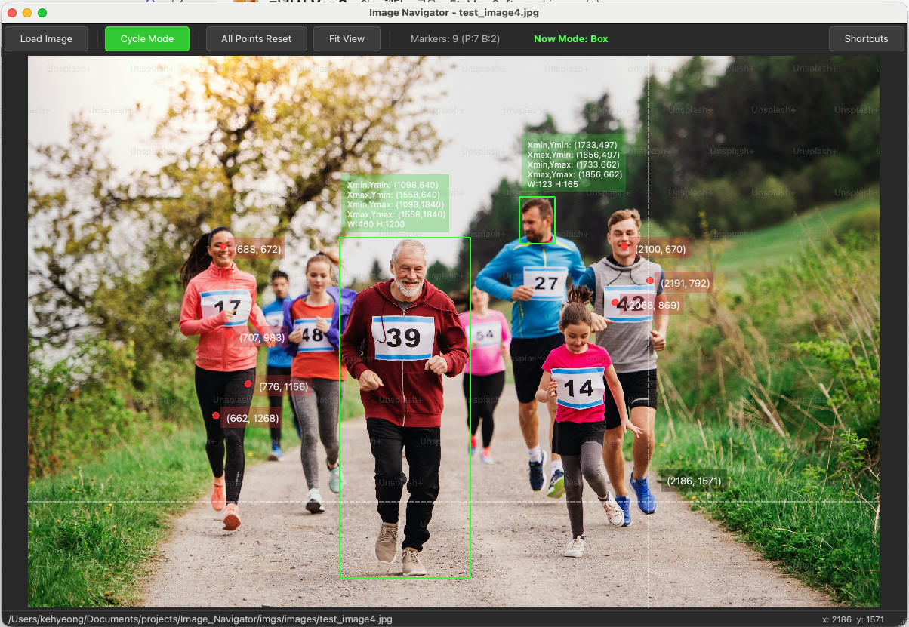

# Image Navigator

비전 프로젝트 개발 보조 도구 — 이미지 좌표 확인 및 포인트 마킹 데스크탑 앱



## About

이미지의 특정 좌표를 확인하고 포인트를 마킹하는 작업이 빈번하게 필요하다. 기존에는 matplotlib 기반의 정적 시각화 유틸리티만 존재하여, 실시간으로 좌표를 탐색하거나 포인트를 인터랙티브하게 마킹하기 어려웠다.

Image Navigator는 이 문제를 해결하기 위해 만든 경량 데스크탑 앱으로, 이미지 위에서 마우스만으로 좌표를 실시간 확인하고, 클릭 한 번으로 포인트를 마킹할 수 있다.

스크립트 실행도 되고 빌드하면 어플처럼 쓸 수 있다.

## Features

- **이미지 로드/표시** — PNG, JPG, BMP, TIFF, WebP 등 주요 포맷 지원. 버튼 클릭 또는 드래그 앤 드롭으로 로드
- **빈 화면 안내** — 이미지가 없을 때 "Drop image here or click Load Image" 안내 문구 표시
- **Hand / Point 모드** — `P` 키로 전환. Hand 모드에서는 드래그로 이동, Point 모드에서는 클릭으로 포인트 마킹
- **실시간 좌표 표시** — 마우스 커서 옆에 (x, y) 좌표가 실시간으로 표시됨 (줌 레벨 무관 고정 크기)
- **십자선 가이드** — 마우스 위치에 얇은 십자선이 표시되어 좌표 파악에 도움
- **포인트 마킹** — Point 모드에서 좌클릭 시 해당 위치에 빨간 점 + 좌표 라벨 표시 (줌 레벨 무관 고정 크기). 커서도 빨간 십자선으로 변경
- **포인트 Undo** — 우클릭으로 가장 최근 포인트부터 하나씩 취소 (양쪽 모드 공통)
- **All Points Reset** — 마킹한 포인트를 모두 제거 (이미지는 유지)
- **Fit View** — 이미지를 뷰에 맞게 원본 비율로 리셋 (`F` 키 또는 Hand 모드 더블클릭)
- **줌 인/아웃** — 마우스 휠로 확대/축소 (양쪽 모드 공통)
- **패닝** — Hand 모드: 좌클릭 드래그 / Point 모드: `Ctrl`+좌클릭 드래그 / 공통: 휠 클릭 드래그
- **단축키 가이드** — 툴바의 Shortcuts 버튼 또는 `Ctrl+/`로 단축키 목록 팝업
- **다크 테마** — 눈의 피로를 줄이는 어두운 UI

## Requirements

- Python 3.10+
- PySide6
- Pillow

## Installation

```bash
git clone <repo-url>
cd image_navigator
pip install -r requirements.txt
```

## Usage

### 커맨드라인 실행

```bash
# 기본 실행
python main.py

# 이미지 경로를 인자로 바로 로드
python main.py /path/to/image.jpg
```

### Mac 앱 빌드 (.app)

```bash
# PyInstaller로 Mac 앱 번들 생성
bash build.sh

# 실행
open dist/ImageNavigator.app

# (선택) Applications 폴더에 복사
cp -r dist/ImageNavigator.app /Applications/
```

### Windows 빌드 (.exe)

```cmd
REM 배치파일 실행
build.bat

REM 실행 파일실행
dist\ImageNavigator\ImageNavigator.exe
```

### 단축키

**General**

| 단축키 | 기능 |
|---|---|
| `Ctrl+O` | 이미지 로드 |
| `P` | Hand / Point 모드 전환 |
| `Ctrl+R` | 모든 포인트 리셋 |
| `Ctrl+/` | 단축키 가이드 |
| `F` | Fit View (원본 비율) |
| 마우스 휠 | 줌 인/아웃 |
| 우클릭 | 최근 포인트 취소 (Undo) |
| 드래그 앤 드롭 | 이미지 파일 로드 |

**Hand Mode**

| 단축키 | 기능 |
|---|---|
| 좌클릭 드래그 | 패닝 (이미지 이동) |
| 더블클릭 | Fit View (원본 비율) |

**Point Mode**

| 단축키 | 기능 |
|---|---|
| 좌클릭 | 포인트 마킹 |
| `Ctrl`+좌클릭 드래그 | 패닝 (이동) |

## Project Structure

```
Image_Navigator/
├── main.py            # 앱 엔트리포인트 + 메인 윈도우 (툴바, 상태바, 다크 테마)
├── canvas.py          # 이미지 캔버스 위젯 (좌표 표시, 포인트 마킹, 줌)
├── requirements.txt   # Python 의존성
├── build.sh           # Mac .app 빌드 스크립트
└── README.md
```

## License

MIT
